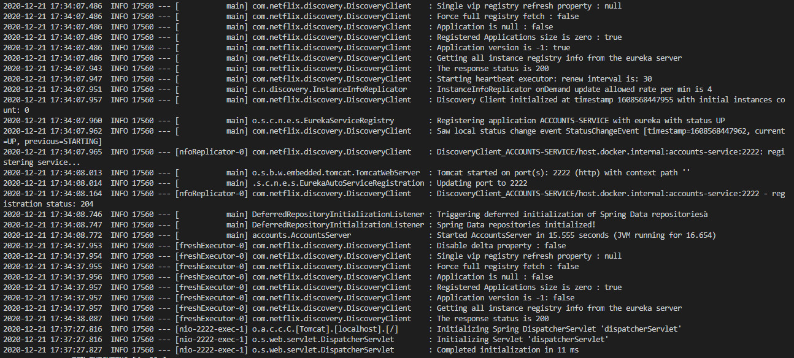
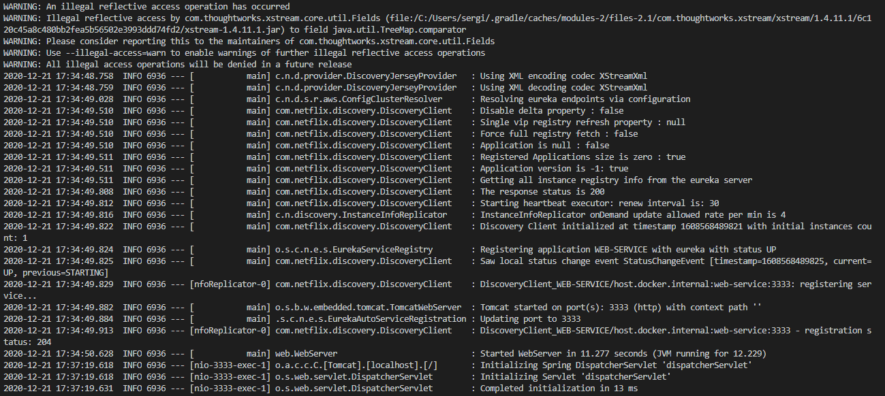
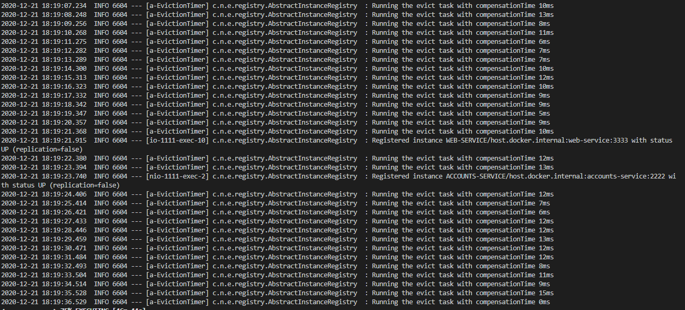
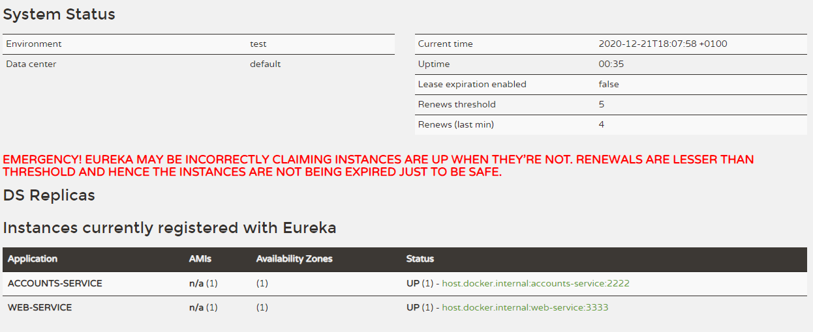
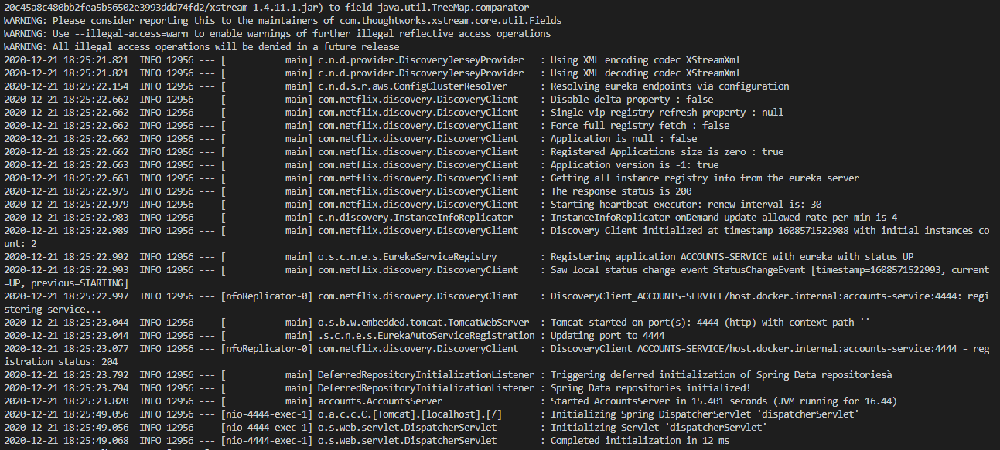
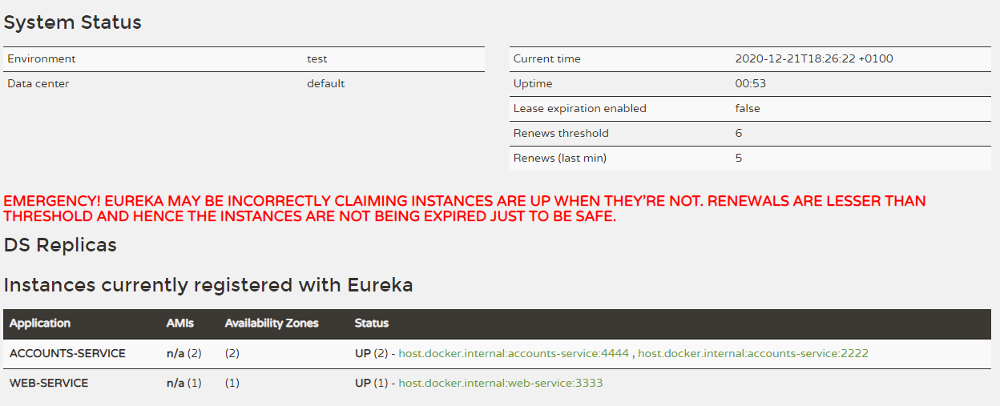

## The two microservices are running and registered (two terminals, logs screenshots)
    - Microserviece at port 2222

    - Microserviece at port 3333

## The service registration service has the two microservices registered (a third terminal, dashboard screenshots)
    - Microserviece registration at port 1111

    - Microserviece registration dashboard

## A second account microservice is running in the port 4444 and it is registered (a fourth terminal, log screenshots)
    - Additional account microserviece at port 4444

    - Additional account microserviece dashboard

## A brief report describing what happens when you kill the microservice with port 2222. Can the web service provide information about the accounts? Why?
    - When the account service dies (port 2222), it becomes unavailable. But since there is another instance of the same service (port 4444), it takes over the workload.
